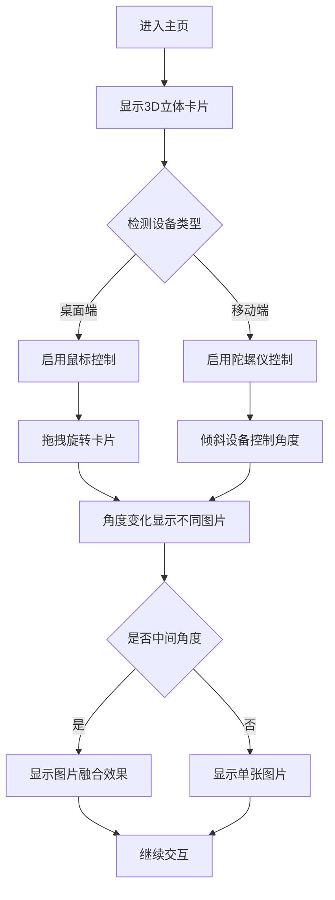

## 1. 产品概述
立体闪卡是一种创新的视觉体验产品，通过3D卡片展示技术让用户从不同角度观看时看到不同的图片效果。用户可以通过鼠标拖拽或手机陀螺仪控制卡片角度，在特定角度还能欣赏到两张图片的完美融合效果。

该产品主要面向追求新颖视觉体验的用户群体，适用于产品展示、艺术创作、教育演示等多种场景，为用户提供沉浸式的交互体验。

## 2. 核心功能

### 2.1 用户角色
本产品为开放式体验，无需用户注册登录即可使用所有功能。

### 2.2 功能模块
立体闪卡网页包含以下核心页面：
1. **主页面**：3D立体卡片展示区、操作提示、效果说明

### 2.3 页面详情
| 页面名称 | 模块名称 | 功能描述 |
|---------|---------|---------|
| 主页面 | 3D卡片展示区 | 居中显示立体卡片，支持鼠标拖拽旋转和陀螺仪控制，根据角度切换显示不同图片 |
| 主页面 | 操作提示区 | 显示操作说明，包括鼠标拖拽方法和陀螺仪使用提示 |
| 主页面 | 效果说明区 | 简要说明闪卡原理和当前显示状态 |

## 3. 核心流程
用户进入网站后，立即可看到居中的3D立体卡片。用户可以通过以下方式与卡片交互：

**桌面端用户流程**：
1. 用户进入主页，看到居中的立体卡片
2. 使用鼠标左键拖拽卡片，卡片会跟随鼠标方向旋转
3. 在不同角度下，卡片显示不同的图片内容
4. 当旋转到中间角度时，两张图片会呈现融合效果
5. 用户可以继续拖拽探索不同的视觉效果

**移动端用户流程**：
1. 用户进入主页，看到居中的立体卡片
2. 通过倾斜手机或平板设备，使用陀螺仪控制卡片角度
3. 卡片会根据设备方向实时旋转
4. 在不同角度下显示对应的图片内容
5. 在中间角度欣赏图片融合效果

## 4. 用户界面设计

### 4.1 设计风格
- **主色调**：深灰色背景（#1a1a1a）突出卡片立体效果
- **卡片颜色**：银灰色金属质感，增强3D视觉效果
- **按钮样式**：简约扁平化设计，避免干扰主体
- **字体**：无衬线字体，现代简洁风格
- **布局风格**：全屏沉浸式布局，卡片居中显示
- **图标风格**：使用简约的线性图标，保持界面整洁

### 4.2 页面设计概述
| 页面名称 | 模块名称 | UI元素 |
|---------|---------|---------|
| 主页面 | 3D卡片展示区 | 卡片尺寸为400x600px，具有金属质感和阴影效果，支持平滑旋转动画 |
| 主页面 | 操作提示区 | 底部显示操作提示文字，字体大小14px，颜色为浅灰色 |
| 主页面 | 效果说明区 | 右上角显示当前角度和融合状态，使用半透明背景卡片 |

### 4.3 响应式设计
采用桌面端优先的设计理念，确保在大屏幕上提供最佳的3D视觉效果。同时适配移动端设备，通过陀螺仪API提供独特的交互体验。界面元素会根据屏幕尺寸自动调整大小和位置，确保在不同设备上都能正常使用。