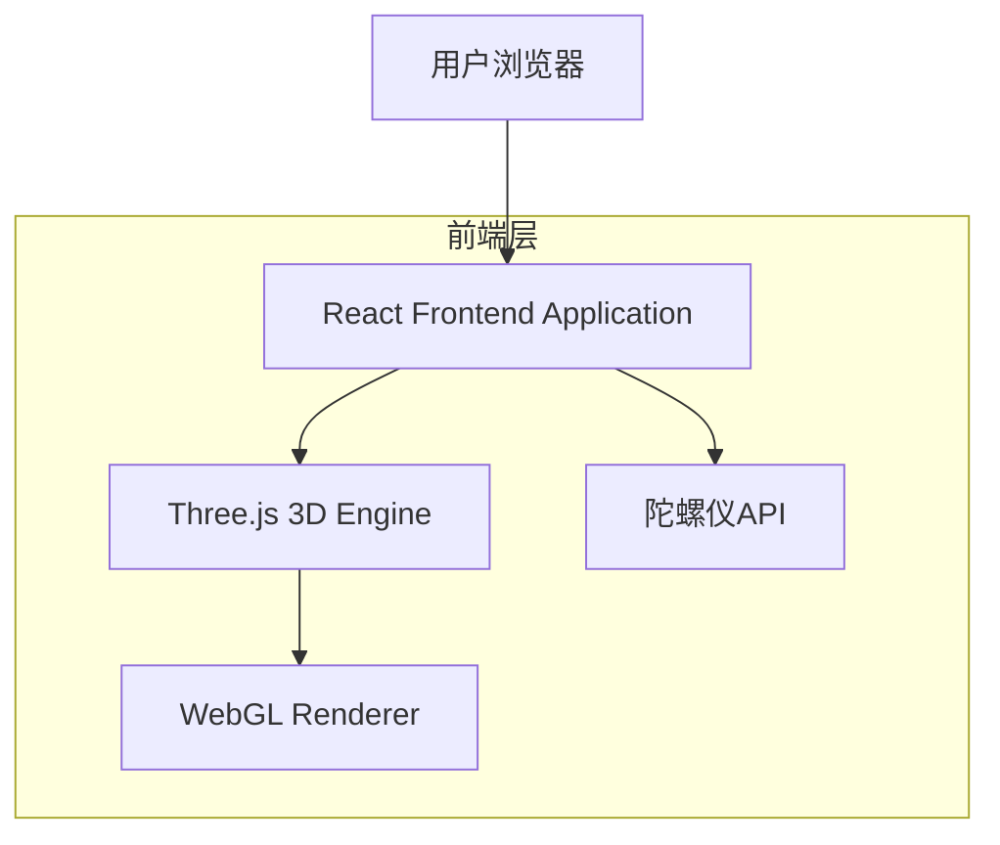
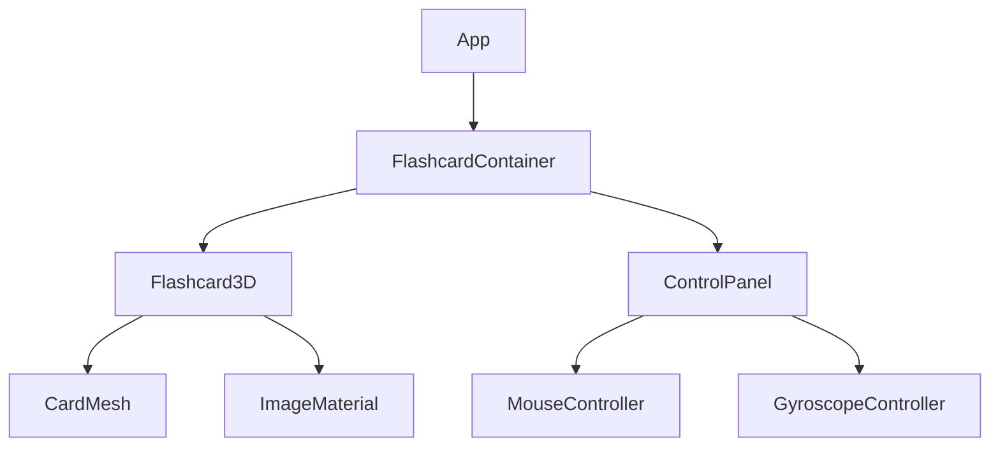

## 1. 架构设计



## 2. 技术描述
- 前端：React@18 + Three.js@0.158 + Vite
- 初始化工具：vite-init
- 后端：无（纯前端应用）
- 主要依赖：
  - three：用于3D图形渲染和立体效果
  - @react-three/fiber：React的Three.js渲染器
  - @react-three/drei：实用的Three.js组件库

## 3. 路由定义
| 路由 | 用途 |
|-------|---------|
| / | 主页，显示3D立体闪卡 |

## 4. 组件架构

### 4.1 核心组件结构


### 4.2 核心状态管理
```typescript
interface FlashcardState {
  rotation: {
    x: number; // X轴旋转角度
    y: number; // Y轴旋转角度
    z: number; // Z轴旋转角度
  };
  currentImageIndex: number; // 当前显示的图片索引
  blendFactor: number; // 融合因子（0-1）
  isGyroscopeEnabled: boolean; // 是否启用陀螺仪
}

interface ImageSet {
  leftImage: string;  // 左侧角度显示的图片URL
  rightImage: string; // 右侧角度显示的图片URL
}
```

### 4.3 3D卡片配置
```typescript
interface CardConfig {
  width: number;      // 卡片宽度
  height: number;     // 卡片高度
  depth: number;      // 卡片厚度
  segments: number;   // 网格细分段数
  material: {
    color: string;    // 基础颜色
    metalness: number; // 金属质感
    roughness: number; // 表面粗糙度
  };
}
```

## 5. 交互控制逻辑

### 5.1 鼠标控制
- 监听鼠标按下、移动、释放事件
- 根据鼠标移动距离计算旋转角度
- 实现平滑的旋转动画效果
- 支持惯性滚动效果

### 5.2 陀螺仪控制
- 检测设备是否支持陀螺仪API
- 监听deviceorientation事件
- 将设备方向转换为卡片旋转角度
- 实现角度平滑过渡

### 5.3 图片切换算法
```typescript
function calculateImageBlend(rotationY: number): { 
  leftOpacity: number; 
  rightOpacity: number;
  blendFactor: number;
} {
  // 基于Y轴旋转角度计算图片透明度和融合因子
  // rotationY范围：-90度到90度
  // 中间角度（-15度到15度）显示融合效果
}
```

## 6. 性能优化

### 6.1 渲染优化
- 使用React.memo防止不必要的重渲染
- 实现虚拟纹理加载，按需加载图片资源
- 使用requestAnimationFrame优化动画性能
- 实现LOD（细节层次）系统，根据距离调整渲染质量

### 6.2 资源管理
- 图片资源预加载和缓存
- 使用WebP格式减少图片大小
- 实现纹理压缩和mipmap生成
- 及时释放不再使用的GPU资源

## 7. 兼容性处理

### 7.1 浏览器兼容性
- 检测WebGL支持情况
- 提供降级方案（CSS 3D变换）
- 处理不同浏览器的陀螺仪API差异
- 添加触摸事件支持作为备用方案

### 7.2 设备适配
- 响应式布局适配不同屏幕尺寸
- 移动端触摸优化
- 高DPI屏幕适配
- 横竖屏切换处理